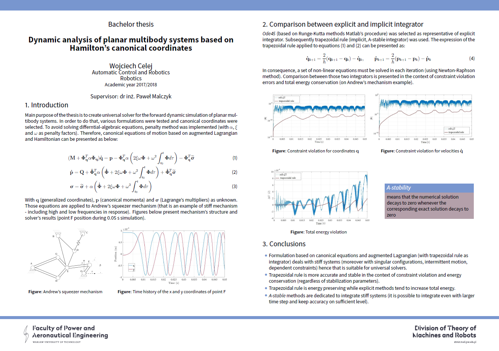

# BSc Thesis

Thesis advisor: Ph.D. Paweł Malczyk

Thesis was prepared at Faculty of Power and Aeronautical Engineering. The software part was written in *Matlab*.

Link to presentation: [link](https://prezi.com/view/L8Yld36IuQ01L9NG0MLf/)

### Title

Dynamic analysis of planar multibody systems based on Hamilton's
canonical coordinates

### Summary

The subject of the thesis is to present various aspects of dynamic analysis of planar multibo-
dy systems based on dependent coordinates. In consequence, a system of differential-algebraic
equations (DAEs) has to be solved in order to predict the system state in the next time instant.
Selected methods for DAE solution are presented in this thesis. Four approaches were imple-
mented. Subsequent formulations are built on top of the previous one. Those four formulations
were tested on double pendulum example. The collected results were compared against Adams
multibody software.
Subsequently, Andrew's squeezer mechanism is implemented using augmented Lagrangian
and Hamilton's canonical equations. Comparison between explicit integrator based on Runge-
Kutta methods and implicit trapezoidal rule was shown as well. Moreover, a discussion is presen-
ted on the in
uence of the simulation settings and penalty parameters on the solution's stability
and accuracy in the context of constraint violation errors and total energy conservation. All
procedures were developed in Matlab software.

Keywords: multibody systems, augmented Lagrangian, Hamilton's canonical equations, dif-
ferential-algebraic equations, DAEs, Andrew's squeezer mechanism

### Poster

